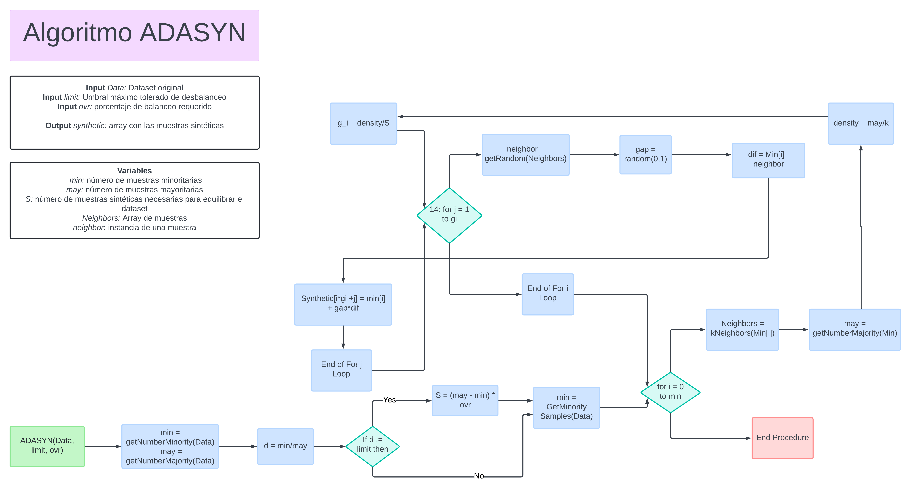
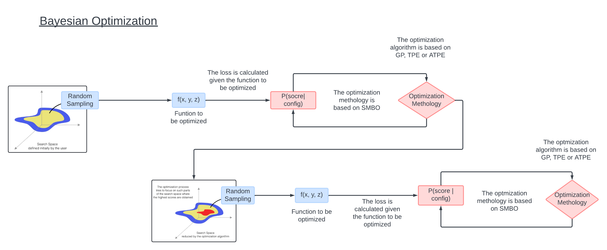

# Informe 
## Algoritmo ADASYN

### *Resumen*

Consiste en una técnica de sobremuestreo utilizada en el aprendizaje automático para abordar el desequilibrio en conjuntos de datos de clasificación. ADASYN ajusta la cantidad de muestras sintéticas generadas según la distribución local de la clase minoritaria. Se prioriza la generación de datos sintéticos en áreas del espacio de características donde la clase minoritaria está menos representada, lo que ayuda a mejorar la capacidad del modelo para generalizar y clasificar correctamente las instancias de la clase minoritaria. Este enfoque adaptativo ayuda a mitigar el riesgo de sobreajuste en modelos de aprendizaje automático. 

ADASYN determina la distribución local de la clase minoritaria calculando la densidad de puntos cercanos en el espacio de características. Luego, asigna pesos a cada instancia de la clase minoritaria en función de esta distribución local. Las instancias con menor densidad de puntos cercanos reciben pesos más altos, lo que significa que se les da más importancia durante la generación de datos sintéticos.  

### *Metodología*

### *Librería (imblearn.over_sampling.ADASYN)*

Parámetros 

- **sampling_strategy** *(float, str, dict, callable, predeterminado='auto')*: Define la estrategia para ajustar el balance de las clases en el conjunto de datos. 

- **random_state** *(int, RandomState instance, predeterminado=None)*: Determina una semilla. 

- **n_neighbors** *(int o estimator object, predeterminado=5)*: Establece los vecinos más cercanos. 

- **n_jobs** *(int, predeterminado=None)*: Especifica el número de núcleos de CPU usados durante el proceso de sobremuestreo.  

Atributos 

- **sampling_strategy_** *(dict)*:  Indicando el número de muestras generadas por cada clase. 

- **nn_estimator_** *(object)*: Estimador de k-vecinos más cercanos. 

- **n_features_in_** *(int)*: Número de características identificadas en el conjunto de datos de entrada. 

## Optimización Bayesiana

### *Resumen*
La optimización bayesiana es una técnica avanzada para encontrar parámetros óptimos en funciones que son costosas de evaluar. Utiliza un modelo probabilístico, como un proceso gaussiano, para prever el rendimiento en función de los datos existentes y una función de adquisición para equilibrar la exploración del espacio de búsqueda con la explotación de áreas prometedoras. La función de adquisición guía la selección del próximo punto a evaluar. Después de cada evaluación, el modelo se actualiza para reflejar los nuevos datos. Este ciclo se repite hasta alcanzar un criterio de terminación, como un límite en el número de evaluaciones o un umbral de mejora en el rendimiento. Esta metodología es especialmente valiosa en situaciones donde las evaluaciones son extremadamente costosas, como en la afinación de hiperparámetros o en pruebas de diseño de ingeniería. 

### *Metodología*

### *Librería*

- **Espacio de búsqueda:** Define el rango de valores para cada hiperparámetro. Por lo general, se representa mediante una función continua y convexa, que sirve como el espacio de exploración durante la optimización. 

- **Función de pérdida:** Es fundamental en el proceso de optimización, ya que cuantifica el rendimiento del modelo según un conjunto dado de hiperparámetros. El objetivo es minimizar esta función mediante ajustes iterativos de los hiperparámetros. 

- **Algoritmo de optimización:** HyperOpt ofrece varios algoritmos de optimización, principalmente el de Optimización Secuencial Basada en Modelos (SMBO, por sus siglas en inglés). Entre las variantes de SMBO se incluyen el Proceso Gaussiano (GP), el Estimador Parzen Estructurado en Árbol (TPE) y el TPE Adaptativo (ATPE). Estos algoritmos guían la búsqueda a través del espacio de hiperparámetros, equilibrando la exploración y la explotación para converger eficientemente hacia soluciones óptimas. 

- **Base de datos de historial (H):** Almacena un registro del historial de evaluaciones, guardando tuplas que consisten en el puntaje alcanzado y la configuración de hiperparámetros correspondiente. Este historial permite a HyperOpt aprender de las iteraciones pasadas y tomar decisiones informadas durante los pasos de optimización posteriores. 

### Referencias: 

ADASYN — Version 0.12.2. (2014). Imbalanced-Learn.org. https://imbalanced-learn.org/stable/references/generated/imblearn.over_sampling.ADASYN.html 

Rui Nian. (2018, December 23). Fixing Imbalanced Datasets: An Introduction to ADASYN (with code!). Medium; Medium. https://medium.com/@ruinian/an-introduction-to-adasyn-with-code-1383a5ece7aa 

Frazier, P. I. (2018). A Tutorial on Bayesian Optimization. ArXiv.org. https://arxiv.org/abs/1807.02811 

skopt.gp_minimize — scikit-optimize 0.8.1 documentation. (2017). Github.io. https://scikit-optimize.github.io/stable/modules/generated/skopt.gp_minimize.html 

‌ 

